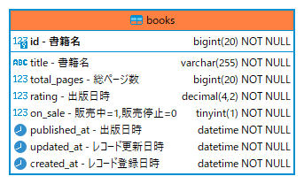

# sample-echo-server

GORM v2 + Echo v4 + zerolog を使用したサンプルHTTPサーバー

## interfaces

- `GET /healthz` ヘルスチェック用
- `GET /v1/books` 書籍全件取得

## How to run

起動前に以下の二つを設定/準備してください。

- 環境変数 `ENV` の設定 (起動時に `config/${ENV}.toml` を読み込みます)
- データベースの作成 (DSN で設定した接続先のデータベース)

### local

```
$ ENV=local go run main.go
```

### Docker

```
$ docker build . \
  --build-arg VERSION=0.0.1 \
  --build-arg ENV=local \
  --build-arg PORT=22222 \
  --build-arg WORKDIR=/go/src/github.com/warawara28/sample-books \
  -t sample-books:0.0.1
$ sudo docker run -p 22222:22222 --name books -e ENV=local sample-books:0.0.1
```

## ER


